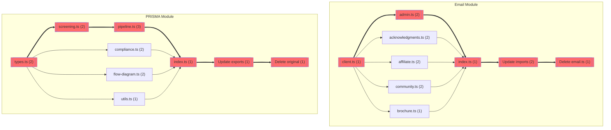

# DAG-Based Refactoring Plan

## Overview

Splitting two large files into well-organized sub-modules using dependency-aware task decomposition.

| File | Current LOC | Target Modules | Estimated Effort |
|------|-------------|----------------|------------------|
| `email.ts` | 1,295 | 6 modules | Medium |
| `prisma-systematic-review.ts` | 1,328 | 5 modules | High |

---

## Task DAG Analysis

### email.ts Decomposition

**Current Structure Analysis:**
```
email.ts (1,295 LOC)
├── Types & Config (lines 1-63)
├── Admin Notifications
│   ├── sendConsultingLeadNotification (lines 72-193)
│   └── sendContactFormNotification (lines 194-300)
├── Customer Acknowledgments
│   ├── sendConsultingLeadAcknowledgment (lines 301-408)
│   └── sendContactFormAcknowledgment (lines 409-521)
├── Affiliate Notifications
│   ├── Types (lines 522-534)
│   ├── sendAffiliateApplicationConfirmation (lines 535-656)
│   └── sendAffiliateStatusUpdate (lines 657-773)
├── Community Notifications
│   ├── sendCommunityReplyNotification (lines 786-873)
│   ├── sendCommunityMentionNotification (lines 887-977)
│   └── sendCommunityMessageNotification (lines 989-1085)
└── Wizard Brochure
    └── sendWizardBrochure (lines 1110-1295)
```

**Proposed Module Structure:**
```
email/
├── index.ts           # Barrel file, re-exports all
├── client.ts          # Resend client, config, EmailResult type
├── admin.ts           # Admin notifications (consulting, contact)
├── acknowledgments.ts # Customer acknowledgment emails
├── affiliate.ts       # Affiliate application emails
├── community.ts       # Community notifications (reply, mention, message)
└── brochure.ts        # Wizard brochure email
```

### prisma-systematic-review.ts Decomposition

**Current Structure Analysis:**
```
prisma-systematic-review.ts (1,328 LOC)
├── Types (lines 34-276)
│   ├── PRISMAPhase, ScreeningDecision, RecordSource
│   ├── LiteratureRecord, EligibilityCriteria, ScreeningConfig
│   ├── PRISMAFlowDiagram, PipelineResult
│   └── ComplianceReport, SystematicReviewReport
├── Internal Helpers (lines 331-648)
│   ├── Screening decision functions
│   └── Record processing utilities
├── Core Pipeline (lines 649-1010)
│   └── processScreeningPipeline (main function)
├── Compliance Validation (lines 1011-1076)
│   └── validatePRISMACompliance
├── Flow Diagram Generation (lines 1077-1160)
│   ├── generateFlowDiagramText
│   └── generateFlowDiagramJSON
└── Utility Functions (lines 1161-1328)
    ├── createRecord, getExclusionStatistics
    ├── validateFlowConsistency
    └── quickScreen, quickComplianceCheck
```

**Proposed Module Structure:**
```
prisma/
├── index.ts           # Barrel file, re-exports all
├── types.ts           # All type definitions
├── screening.ts       # Internal screening helpers
├── pipeline.ts        # Core processScreeningPipeline
├── compliance.ts      # validatePRISMACompliance
├── flow-diagram.ts    # Flow diagram generation
└── utils.ts           # Utility and quick functions
```

---

## Task DAG

### Tasks (with dependencies and durations)

| ID | Task | Duration | Dependencies | Slack |
|----|------|----------|--------------|-------|
| **E1** | Create email/client.ts (config, types) | 1 | - | 0 |
| **E2** | Create email/admin.ts | 2 | E1 | 0 |
| **E3** | Create email/acknowledgments.ts | 2 | E1 | 1 |
| **E4** | Create email/affiliate.ts | 2 | E1 | 1 |
| **E5** | Create email/community.ts | 2 | E1 | 1 |
| **E6** | Create email/brochure.ts | 1 | E1 | 2 |
| **E7** | Create email/index.ts barrel | 1 | E2,E3,E4,E5,E6 | 0 |
| **E8** | Update imports across codebase | 2 | E7 | 0 |
| **E9** | Delete original email.ts | 1 | E8 | 0 |
| **P1** | Create prisma/types.ts | 2 | - | 0 |
| **P2** | Create prisma/screening.ts | 2 | P1 | 1 |
| **P3** | Create prisma/pipeline.ts | 3 | P1,P2 | 0 |
| **P4** | Create prisma/compliance.ts | 2 | P1 | 1 |
| **P5** | Create prisma/flow-diagram.ts | 2 | P1 | 1 |
| **P6** | Create prisma/utils.ts | 1 | P1 | 2 |
| **P7** | Create prisma/index.ts barrel | 1 | P3,P4,P5,P6 | 0 |
| **P8** | Update algorithm/index.ts exports | 1 | P7 | 0 |
| **P9** | Delete original file | 1 | P8 | 0 |

### Critical Paths

**Email Module:**
```
E1 → E2 → E7 → E8 → E9
Duration: 7 units
```

**PRISMA Module:**
```
P1 → P2 → P3 → P7 → P8 → P9
Duration: 10 units
```

### Parallel Execution Layers

**Layer 1 (Independent):**
- E1: Create email/client.ts
- P1: Create prisma/types.ts

**Layer 2 (After types):**
- E2, E3, E4, E5, E6: All email modules (parallel)
- P2, P4, P5, P6: PRISMA modules (parallel, except P3)

**Layer 3 (After E2 complete):**
- P3: Create prisma/pipeline.ts (depends on P1, P2)

**Layer 4 (After all modules):**
- E7, P7: Create barrel files

**Layer 5 (After barrels):**
- E8, P8: Update imports

**Layer 6 (Final cleanup):**
- E9, P9: Delete original files

---

## Mermaid Diagram



---

## Execution Strategy

### Recommended Order (Optimized)

Since both module refactors are independent, execute them in parallel:

**Batch 1 (Parallel):**
- E1: Create email/client.ts
- P1: Create prisma/types.ts

**Batch 2 (Parallel):**
- E2-E6: All email modules
- P2, P4, P5, P6: PRISMA helpers

**Batch 3:**
- P3: Create prisma/pipeline.ts (after P2)

**Batch 4 (Parallel):**
- E7: Create email/index.ts
- P7: Create prisma/index.ts

**Batch 5 (Parallel):**
- E8: Update email imports
- P8: Update algorithm exports

**Batch 6 (Parallel):**
- E9: Delete email.ts
- P9: Delete prisma-systematic-review.ts

### Risk Factors

1. **Import Chain Complexity**: email.ts is imported 38 times across codebase
2. **Type Exports**: Both files export types that may be imported separately
3. **Internal Dependencies**: screening.ts is used by pipeline.ts

### Recommendations

1. **Start with Email** - Simpler structure, more parallel opportunities
2. **Types First** - Always extract types before functions to avoid circular deps
3. **Test After Each Module** - Run `npm run typecheck` after each module creation
4. **Preserve Barrel Compatibility** - Keep `@/lib/email` import path working

---

## Success Criteria

- [ ] All original exports available via barrel files
- [ ] No broken imports across codebase
- [ ] TypeScript compilation passes
- [ ] Each new module < 300 LOC
- [ ] Original files deleted
